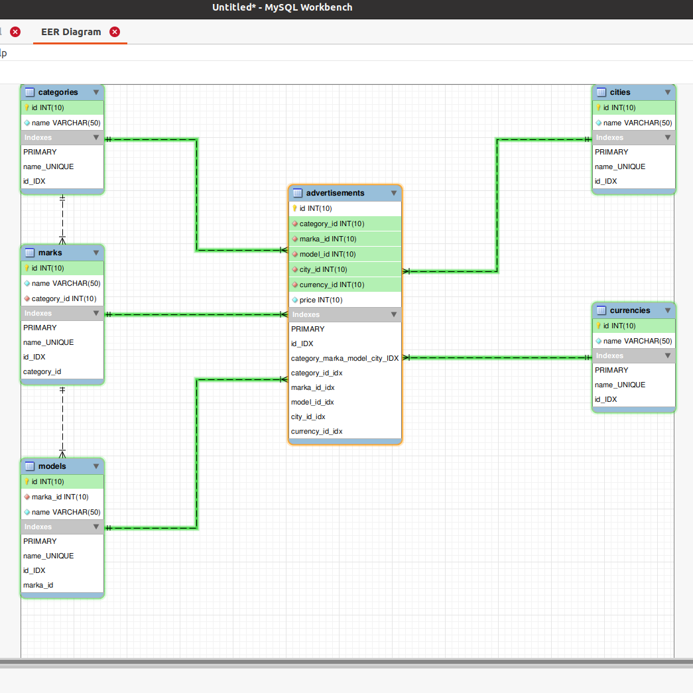

# Реляційні бази даних. Проектування баз даних MySQ (1).

## Пояснення рішення завдання:

### Виконано на системі керування реляційною базою даних - MariaDB.

#### [ЗАВДАННЯ 1](./MySQL(1).sql)
- Створена схема бази даних та наповнена тестовими даними.
- Застосовано атрибут PRIMARY KEY - з метою ідентифікування кортежа даного відношення.
- Застосовано атрибут FOREIGN KEY - з метою описати залежність однієї таблиці від іншої.
- Застосовано вираз ON DELETE RESTRICT - з метою захисту від видалення рядків в головній таблиці при наявності пов'язаних рядків у залежній таблиці.
- Застосовано вираз ON UPDATE CASCADE - з метою автоматичної зміни рядків з залежної таблиці при зміні пов'язаних рядків в головній таблиці.
- Застосовано атрибут INDEX - з метою підвищення ефективності виконання запитів.
- Схема бази данних нормалізована у третю нормальну форму (3NF), для всіх таблиць, окрім advertisements.
- Таблиця advertisements денормалізована - з метою прискорення пошуку по полям category_id, marka_id, model_id, city_id, currency_id, зменшення витрати пам'яті та зменшення застосування JOIN'ів при запитах.

##### Схема бази данних: 
